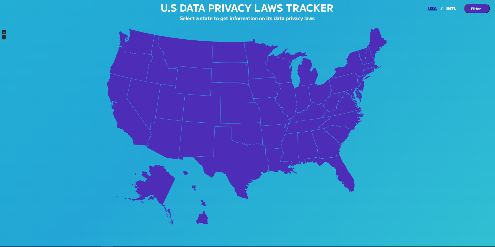
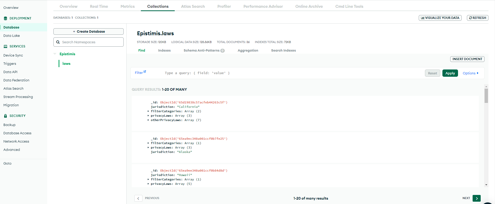
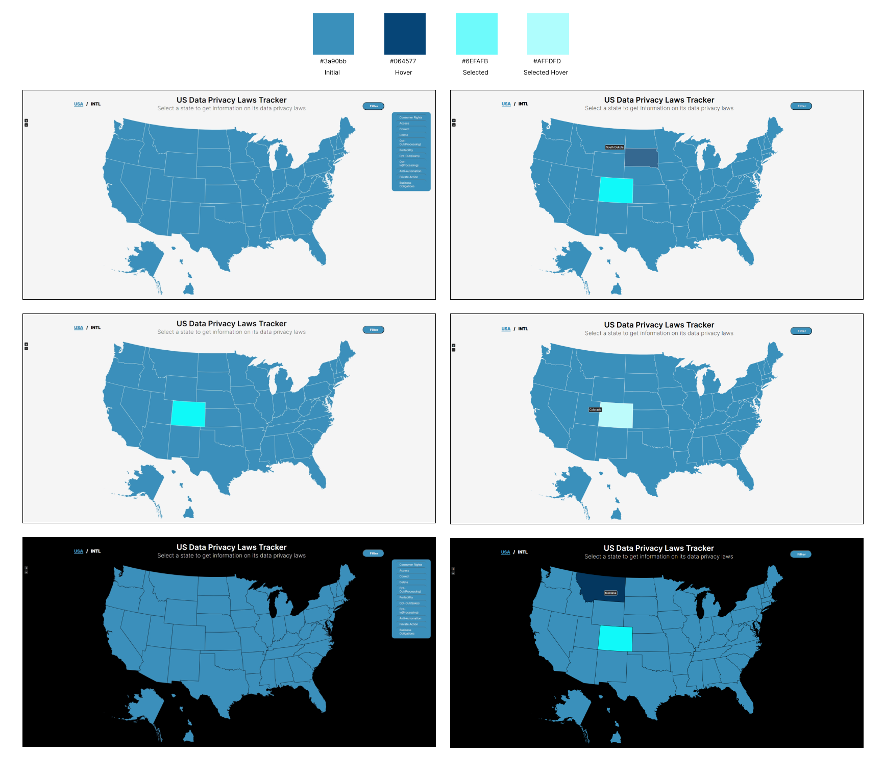
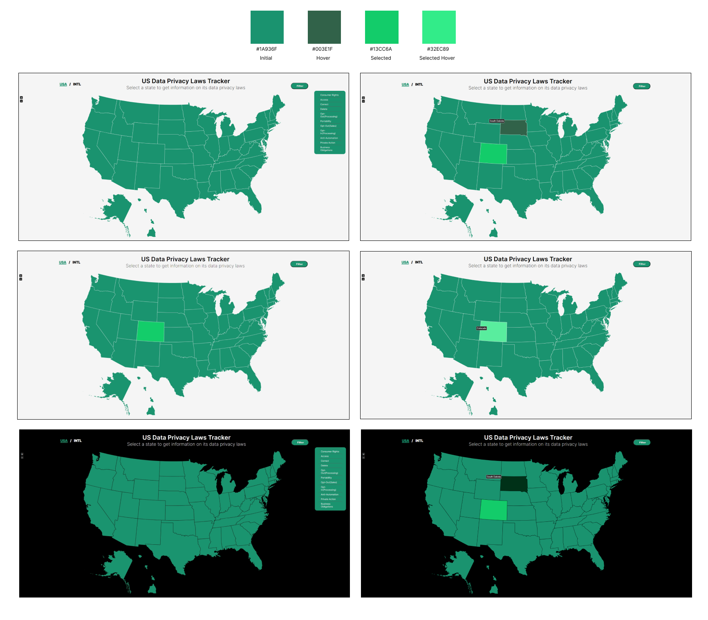
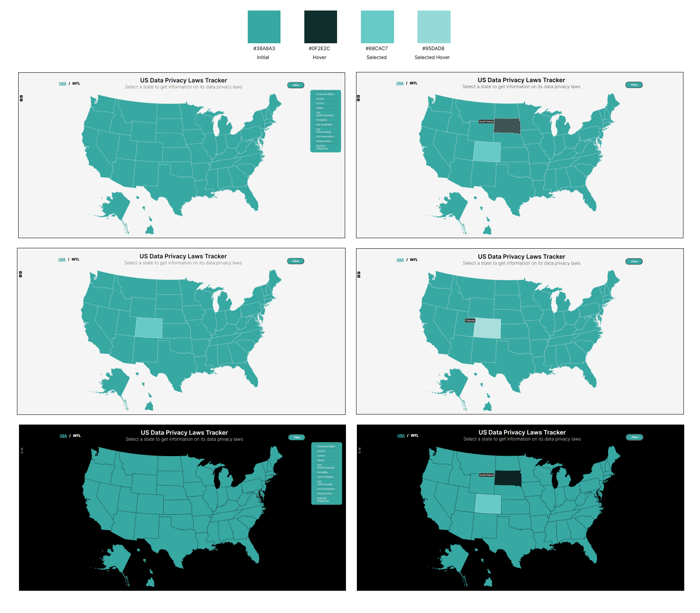

# EpistimisLLC
Group: Joseph Karper, Dima Melnik, Thai Nguyen, Saunder VanWoerden

## How to run
To launch the web app, navigate to the /client folder.\
Then use the following commands:\
npm install\
npm start

To the server, navigate to the /server folder.\
Then use the following commands:\
npm install\
npm run dev

## Figma Design
https://www.figma.com/file/0ia0WrbUrXdLhmNNPbrAlv/Epistimis-REAL?type=design&node-id=0-1&mode=design&t=1HgqZaHhhhjmtj27-0

## Q2 Demo
Click on the image below to navigate to the video:

## MongoDB

## Final Database Schema
{
    "jurisdiction": "string",
    "filterCategories": ["", ""],
    "privacyLaws": [
        {
            "lawName": "string",
            "description": "string",
            "reference": "string",
            "billStatus": "introduced, signed or in force",
            "inEffect" : "date",
            "applicability": [ 
                {
                    "roles": ["string"],
                    "personalDataCategories": ["string"],
                    "processingPurposes": ["string"],
                    "consentRequired": "boolean"
                }
            ],
            "individualRights": [
                {
                    "name": "string",
                    "reference": ["string"]
                }
            ],
            "businessObligations": {
                "notice": [ {
                        "description": "string",
                        "reference": "string"
                    }
                ],
                "lawfulBasis": [ {
                        "description": "string",
                        "reference": "string"
                    }
                ],
                "purposeLimitation": [  {
                        "description": "string",
                        "reference": "string"
                    }
                ],
                "dataMinimization": [ {
                        "description": "string",
                        "reference": "string"
                    }
                ],
                "securityReqs": [ {
                        "description": "string",
                        "reference": "string"
                    }
                ],
                "privacyByDesign": [  {
                        "description": "string",
                        "reference": "string"
                    }
                ],
                "processorReqs": [ {
                        "description": "string",
                        "reference": "string"
                    }
                ],
                "recordKeeper": [ {
                        "description": "string",
                        "reference": "string"
                    }
                ],
                "riskImpact": [ {
                        "description": "string",
                        "reference": "string"
                    }
                ],
                "breachNotification": [ {
                        "description": "string",
                        "reference": "string"
                    }
                ],
                "registration": [ {
                        "description": "string",
                        "reference": "string"
                    }
                ],
                "dpo": [ {
                        "description": "string",
                        "reference": "string"
                    }
                ],
                "dataTransfer": [ {
                        "description": "string",
                        "reference": "string"
                    }
                ]
            },
            "scope": [
                {
                    "exemptions": [
                        {
                            "type": "string",
                            "description": "string"
                        }
                    ],             
                    "nonProfitsCovered": ["string"],
                    "verticalCarveouts" : ["string"],
                    "preemption": ["string"]
                }
            ],
            "enforcement": [ {
                "enforcementAuthority": ["string"],
                "rulemakingAuthority": ["string"],
                "finingAuthority": ["string"],
                "penalties": [ "string"],
                "personalLiability": ["string"],
                "privateRightOfAction" : ["string"]
                }
            ],
            "threshold": [
                {
                    "type": "string",
                    "description": "string"
                }
            ]
         }
    ],
    "otherPrivacyLaws":[
        {
            "jurisdiction": "string",
            "filterCategories": ["", ""],
            "privacyLaws": [
                {
                    "lawName": "string",
                    "type": "Introduced, Minor or Inactive",
                    "description": "string",
                    "reference": ""
                }
            ]
        }
    ]
}

## New Color Theme Proposals

### Blue - Productivity
Some research sugests that people are more productive in a blue environment. Blue in general is a relaxing and calming color.

### Green - Concentration
Low wavelength colors promote restfulness and calm, and they improve efficiency and focus. Easiest color on the eyes.

### Teal - A Mix of Both
