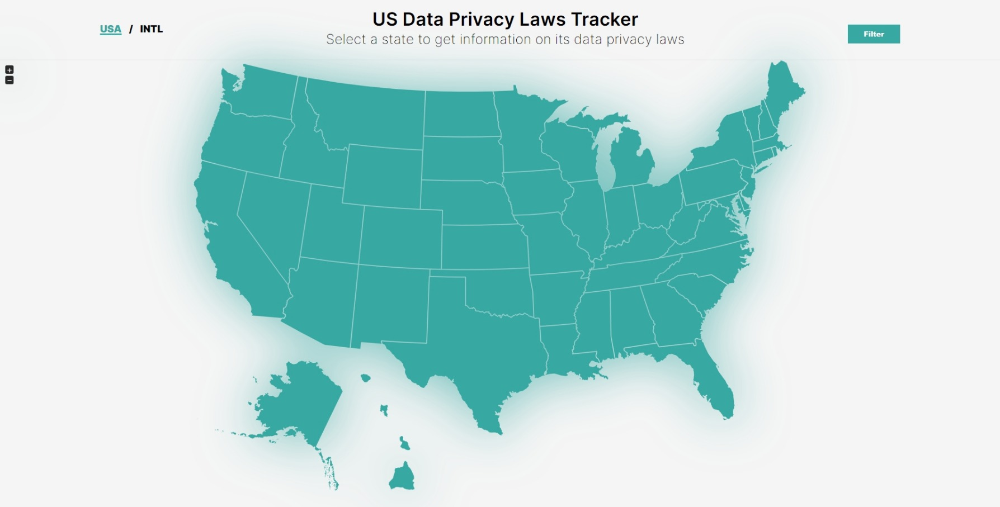

# Epistimis | Interactive Data Privacy Laws Map | Dynamic Infographics
Project Members 23-24:
- [Joseph Karper]()
- [Dima Melnik](https://www.linkedin.com/in/dima-melnikmv/)
- [Thai Nguyen](https://www.linkedin.com/in/quocdthaidnguyen/)
- [Saunder vanWoerden](https://www.linkedin.com/in/saunder-vanwoerden-8a1a2a242/)

## Getting Started
To launch the web app, navigate to the directory:
```bash
/epistimis-next
```

Then use the following commands:\
```bash
npm install
#then
npm run dev
```

Open [http://localhost:3000](http://localhost:3000) with your browser to see the result.


## Figma Design
Here's our original idea for the application is in this
[Figma](https://www.figma.com/file/0ia0WrbUrXdLhmNNPbrAlv/Epistimis-REAL?type=design&node-id=0-1&mode=design&t=1HgqZaHhhhjmtj27-0). Although things have changed quite a bit during development, the essence our plan remained the same.

## Q3 Deliverables
Click on the image below to navigate to the website or click [here](https://epistimis-llc.vercel.app/):

[](https://epistimis-llc.vercel.app/)

## MongoDB


